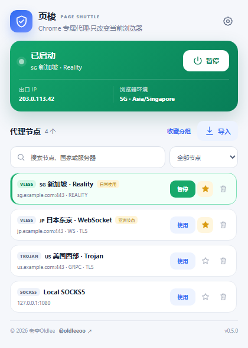
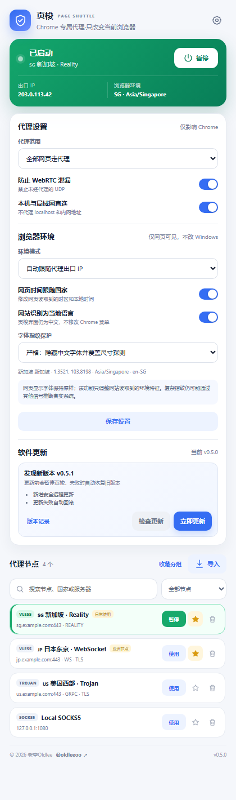

<div align="center">
  
  <h1>页梭 · Page Shuttle</h1>
  <p><strong>只改变 Chrome，不接管整台电脑的代理与网页环境工具</strong></p>
  <p>
    <a href="https://github.com/Oldleeo/PageShuttle/releases/latest"></a>
    <a href="https://github.com/Oldleeo/PageShuttle/actions/workflows/ci.yml"></a>
    <a href="LICENSE"></a>
    
    
  </p>
  <p>作者：<a href="https://x.com/oldleeoo"><strong>老李Oldlee</strong> · @oldleeoo</a></p>
</div>

---

页梭是一个 Windows + Chrome 工具。扩展负责节点管理、Chrome 代理和网页环境一致性；本地助手只把 VLESS、VMess、Trojan、Shadowsocks 转换为 `127.0.0.1` 上的临时 SOCKS5 端口。

它不会修改 Windows 系统代理、WinHTTP、TUN/TAP、系统时间、系统语言、系统定位或防火墙规则。

## 界面预览

| 节点管理 | 浏览器环境与安全更新 |
| --- | --- |
|  |  |

## 功能

- 导入 Clash YAML、Base64 订阅和常用代理链接；
- 支持 VLESS、VMess、Trojan、Shadowsocks、HTTP、HTTPS、SOCKS4、SOCKS5；
- 节点搜索、收藏和自定义收藏分组；
- 全部网页代理或按域名分流；
- 一键启动、暂停和出口 IP 检测；
- WebRTC 非代理 UDP 保护；
- 自动按代理出口 IP 同步网页可见坐标、国家 locale、IANA 时区和本地时间；
- 支持手动指定国家、经纬度、语言和时区；
- 隐藏常见中文字体 API、Canvas 宽度与 DOM 尺寸探测，不改变实际显示字体；
- GitHub Releases 签名更新、更新前备份和失败自动回滚。

> 网页环境功能用于减少浏览器环境与代理出口之间的明显矛盾，不承诺绕过所有指纹技术或网站风控。

## 快速安装

1. 在 [Releases](https://github.com/Oldleeo/PageShuttle/releases/latest) 下载 `PageShuttle-v版本-win-x64.zip`。
2. 完整解压，双击 `安装 页梭.cmd`，不需要管理员权限。
3. 打开 `chrome://extensions` 并开启“开发者模式”。
4. 点击“加载已解压的扩展程序”，选择安装器显示的 `extension` 目录。
5. 固定页梭，导入节点后点击“启动”。

详细步骤见 [安装教程](docs/INSTALL.md) 和 [使用教程](docs/USER_GUIDE.md)。

Chrome 不允许普通扩展在第一次使用时直接运行电脑中的安装脚本，因此首次安装需要用户手动确认。v0.5.0 之后的新版本可在扩展中一键更新。

## 安全边界

```text
Chrome 网页
   │
   ├─ Chrome proxy API ── HTTP / SOCKS 节点
   │
   └─ Native Messaging ── 页梭 helper ── 127.0.0.1 临时 SOCKS5 ── Xray ── VLESS/VMess/Trojan/SS
```

- Xray 只监听 `127.0.0.1`，局域网设备无法连接；
- helper 不安装 Windows 服务，Chrome 连接结束后通过 Job Object 关闭子进程；
- 安装器按完整可执行文件路径停止页梭自身进程，不会关闭 v2rayN 的 Xray；
- 节点与密码保存在 Chrome 本地扩展存储，不同步到作者服务器；
- 更新包必须通过 SHA-256 与 RSA-3072/PSS 数字签名验证；
- 更新时保留旧目录，替换异常会自动回滚。

更多细节见 [更新安全设计](docs/UPDATE_SECURITY.md)、[隐私说明](PRIVACY.md) 和 [安全政策](SECURITY.md)。

## 支持的常用参数

VLESS / VMess / Trojan 支持 TCP、WebSocket、gRPC、HTTPUpgrade、XHTTP，以及 TLS/REALITY 常用参数。不同客户端产生的私有 Clash 字段可能需要单独适配，欢迎提交脱敏后的 Issue。

## 从源码构建

环境：Windows、PowerShell 7、Node.js 22、.NET 8 SDK。

```powershell
dotnet restore host\ChromeProxyHost.csproj --configfile NuGet.Config
dotnet restore updater\PageShuttleUpdater.csproj --configfile NuGet.Config

node tests\parser.test.cjs
node tests\state-utils.test.cjs
node tests\location-override.test.cjs

.\scripts\Get-Xray.ps1
.\scripts\Build-Release.ps1
```

发布签名私钥不在仓库中。自行构建发行包时，需要通过 `-SigningKeyPath` 指定自己的 RSA 私钥。不要使用作者公钥为第三方构建背书。

## 开源许可

页梭自研代码采用 [MIT License](LICENSE)。

- Xray-core：Mozilla Public License 2.0；
- js-yaml：MIT License；
- “页梭 / Page Shuttle”、品牌图形与“老李Oldlee”身份标识不得用于暗示作者为第三方衍生项目背书。

## 作者

Copyright © 2026 [老李Oldlee](https://x.com/oldleeoo)。

- X：[@oldleeoo](https://x.com/oldleeoo)
- GitHub：[@Oldleeo](https://github.com/Oldleeo)
